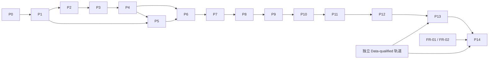

# 实施路线图

本页维护工作顺序与入口条件。系统设计见[架构文档](docs/architecture/overview.md)，
阶段结果见[当前状态](docs/status/README.md)，精确资格绑定见[发布记录](docs/releases/README.md)。

## 当前落点

| 工作 | 当前范围 |
|---|---|
| P0–P7 | Offline Engineering 与 Data-qualified 工程发布完成 |
| P8–P13 | 已完成各自批准范围；不合并推导额外 Agent 能力 |
| FR-01 / FR-02 | P14 的 DSL 贯通与不可变 ResearchResult 入口已完成 |
| P14a / P14b / P14c | Ledger、有限候选枚举、有限工程选择资格完成 |
| P14d-A / P14d-B | 确定性编排与 synthetic 自主工程资格完成 |
| P14-DQ | 精确冻结输入和环境内工程资格完成；研究结果仍未进入选择 |
| P14 RC | `3a4a898` 独立 RC 复审 `APPROVE`，待记录发布标记 |
| FR-03 / P14d-C | `NO_GO / THIN_MAINTENANCE` / `BLOCKED_UNIMPLEMENTED` |

本次文档整理沿用生产实现 `e318dc4` 和已有资格报告；不授予新的生产、研究或运行时权威。
文档审阅与后继修订见[审阅记录](docs/reviews/p14-rc-documentation-successor-review.md)。
独立 RC 复审见[精确提交复审报告](docs/reviews/p14-rc-3a4a898-independent-review.md)，
审阅对象为 `3a4a898f74ce2f60a14d2a69250024e92a4378c1`。

## 下一项工作

1. 为已独立复审的 `3a4a898f74ce2f60a14d2a69250024e92a4378c1` 记录 RC tag
   或 release marker，并冻结 P14 主线；登记同时绑定复审报告、其登记提交与生产实现 `e318dc4`。

发布管理步骤不修改生产代码。历史提交 `9e2fc41` 和更早的 blocked RC 保持可追溯。

## 实施依赖

实现可以按依赖并行推进；阶段完成声明必须满足依赖的验收条件。

| 路线 | 详细验收条件 |
|---|---|
| P0–P7：确定性数据、研究、回测、验证与 Registry | [第一阶段](docs/roadmap/stage-one.md) |
| P8–P14：Evidence、proposal、admission 与有界 campaign | [第二阶段](docs/roadmap/stage-two.md) |
| FR-03：官方 Codex SDK/runtime | [冻结维护政策与重资格入口](docs/status/fr03.md) |

## 范围约束

目标是 A 股日频 / 中低频研究。实盘交易、券商接口、分钟与 Tick 数据、
第二 canonical provider、基本面正式接入、动态 grammar、mutation/crossover 和多模型 Council
需要独立立项与资格门，均不由当前路线自动授权。

工程验收考察可审计执行与证据复现。收益软门拒绝可以是正确研究结果，盈利不是工程 DoD。

## 规则与设计依据

| 主题 | 规范入口 |
|---|---|
| 仓库硬性规则 | [AGENTS.md](AGENTS.md) |
| Contracts、状态、哈希与不可变产物 | [Contracts 与 provenance](docs/architecture/contracts.md) |
| 采集、快照、时间语义与 PIT | [数据与 PIT](docs/architecture/data-and-pit.md) |
| Qlib、Signal、ResearchResult 与回测 | [研究与回测](docs/architecture/research-and-backtest.md) |
| Gate、稳健性、OOS 与 Registry | [验证与 Registry](docs/architecture/validation-and-registry.md) |
| Agent、Evidence、预算与 campaign | [Agent 与 campaign](docs/architecture/agent-and-campaign.md) |
| Go / No-Go 风险 | [风险登记](docs/reference/risks.md) |
| 历次 ADR | [决策索引](docs/adr/README.md) |

原 v14 的完整任务编号、阶段记述和旧验收结果保存在
[2026-09-29 文档快照](docs/history/2026-09-29/PLAN.md)。
该快照中的阶段状态按原提交解释。
