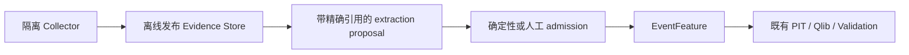

# Agent 与 campaign

Agent 提出 observation、hypothesis、factor、experiment 和 interpretation。
确定性应用负责 admission、执行、Validation 和 selection。
Agent 输出不能成为自行认证的 evidence。

## Evidence 与 admission

来源 bytes 与获取记录是可审计来源证据，不是对真实世界事实的自动认证。
Evidence 区分 published、fetched、observed、available 时间；修订和撤回追加记录。

Citation 绑定 Evidence/text hashes 和 page/character range。
Admission 重新验证引用、entity、event label/time、attributes、研究使用 permission 与 availability。
`UNKNOWN` availability 或 permission 无法形成合格 EventFeature。

P13 v2 的批准 benchmark 只证明单公告、带引用位置提示及既有 proposal 的冻结范围。
重新进行 live extraction 仍受当前 [FR-03](../status/fr03.md)入口门约束。

## Typed capabilities 与运行边界

- 输入为 bounded schema、logical ID 与内容 hash，不给任意 shell/path/secret 能力。
- Authority resolver 仅允许配置的 domain + hash，拒绝逃逸、alias 和 symlink。
- Agent 不直接运行 quantos CLI、写 snapshot/Registry、更改 verdict 或 unseal OOS。
- 写 proposal 必须绑定 idempotency、AgentRun、Campaign、Budget 与 input hashes。
- 确定性 application 重新验证请求，再调用既有服务并发布结果。
- 队列固定容量、查询、取消、超时、restart 与稳定失败语义。

Typed service façade、transport adapter 和实际 Agent runtime 分别需要证据。
P11 的 direct-facade synthetic E2E 不自动资格化 production transport 或 live 组合链。
当前 P14 Scripted/Replay 不获得 Live Agent 资格。

三个 repo Skills 对应 researcher、formalizer、reviewer；它们提供角色工作流指令与约束，
不构成独立多进程“研究委员会”或新的判定权威。

## Agent provenance

AgentRun 绑定 model/config 标识、harness/runtime、capability policy、instructions、
AGENTS/Skills/schema、inputs、request/response、proposal、transcript、retry/usage 与 failure。

Requested sandbox policy 与实际观察到的权限行为分别记录。
Model 标识不等于 immutable weights snapshot；不声称 LLM 输出逐字节可复现。
Secret 与无界原文不进入 failure log。

## Ledger 与 ContextPack

Ledger 分离 source assertion、Agent proposal、人工判断、确定性 experiment evidence 和 verdict。
状态由不可变事件与 snapshot 重建，搜索索引仅为缓存。

SearchResult/ContextPack 绑定 ledger snapshot、query/result/index、model/tokenizer、
budget 与稳定 tie-breaker hashes。Agent 使用的上下文可审计，不依赖浮动“最近结果”。

## 预冻结有限搜索

ResearchFamily、Budget、Campaign 和 enumeration template 在 trial 前 hash-bound：

| 冻结项 | 含义 |
|---|---|
| Family / AST / candidate identity | 有限候选、canonical 顺序与重复证据 |
| Inputs / periods / policy | 明确数据与验证窗口 |
| Budget / stopping rule | 确定性 accounting；不使用 wall time 作为权威预算 |
| Trial ledger | schema invalid、PIT reject、execution failure、soft/hard reject、PASS、duplicate 全部留证 |

幂等 retry 复用既有事件；冲突 idempotency key 拒绝。
不能动态 mutation/crossover、改变候选家族或隐藏失败来缩小分母。

`ReplayAgentDriver` 只重放已保存的 Agent exchange。
相同 execution identity 已有通过核验的 execution receipt 时，执行 adapter 才直接复用结果，
不再次调用 Qlib；缺少 receipt 的恢复可继续执行 pipeline。

## P14c selection

CampaignSelectionReport 消费完整 trial set 和已验证 native Qlib Rank IC ResearchResult；
其 resolved evaluation 区间必须完全位于冻结 campaign 的 validation segment。
冻结方法先按预声明共同方向定向 daily Rank IC，再检验其均值是否大于零；
输入至少 40 个 session，且样本方差非零。使用 5-session circular block bootstrap、
9999 replicates 和确定性 SHA counter，
再对完整 finite family 应用 Holm，alpha `0.05`，最多选择一个候选。

Ineligible/failure 候选仍按冻结规则进入 denominator；不完整来源产生
`FAILED / NOT_EVALUATED / SOURCE_INCOMPLETE`，不能绕过完整性做选择。
具体 eligibility、p-value ties、排序与 stationarity 假设见
[P14c 冻结契约](../p14c-selection-contract.md)。

Single-experiment PASS 不等于 campaign selection。
`SelectionFrozen` 绑定经验证报告和选中候选；之后不再追加 development/validation trial，
且必须先于 sealed `OOSAccessed`。
Synthetic `SELECTED → SelectionFrozen → READY_FOR_SEALED_CONFIRMATION` 证明工程状态转换，
不授予真实市场选择或 sealed-confirmation 资格。

## Sealed access 与污染

Campaign `ACTIVE` 可追加 trial 或关闭。
一次 sealed `OOSAccessed` 关闭 campaign 并记录污染；后继解释和 campaign 继承污染。
新的 confirmation 需新的 snapshot 和未来未暴露窗口，不能以改名重用旧 OOS。

这些是已实现治理规则。当前 sealed confirmation 未资格化，P14d-C 未实现，
alpha、盈利、投资适用性与无限制自主研究均未获权威。

- [P14 当前状态](../status/p14.md)
- [冻结契约与批准索引](../contracts/README.md)
- [Ledger/campaign CLI](../reference/cli.md)
