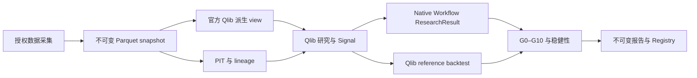

# 架构总览

系统以冻结输入、确定性执行和可审计输出为核心。
第一阶段覆盖 A 股日频/周频研究；第二阶段增加 Evidence、proposal、Ledger 和有界 campaign。

## 主流程

市场数据网络访问结束于 snapshot acquisition。
研究、PIT、回测、Validation 和 Registry 只读取冻结本地输入。

图中的 Validation/Registry 完整链对应 expression 路径。
事件信号使用独立 artifact schema；P13 v2 的批准范围见[冻结记录](../p13-v2-freeze.md)。

## 四个边界

| 边界 | 职责 | 权威 |
|---|---|---|
| Acquisition | Tushare snapshot；隔离的公告 Collector | 冻结来源与采集记录 |
| Agent | 读取 Evidence/ContextPack，提出和解释研究建议 | proposal，不具备 verdict |
| Deterministic application | admission、spec resolution、Qlib 执行、validation、选择 | 经核验的确定性证据 |
| Artifact / history | hash-addressed 产物、Ledger、Registry、campaign events | 不可变内容与可重建历史 |

公告 Collector 是独立网络入口，公告不作为市场 snapshot。
Canonical Agent/Evaluation 要求禁网；实际权限有效性由相应 runtime 资格证据证明。
Publisher 和 admission 分别验证冻结来源及特征适用性。

## 复用范围

| 能力 | 使用的组件 |
|---|---|
| Qlib view | 官方 `dump_bin` 和 data-health 脚本 |
| 表达式与模型 | 官方 expression provider、`DatasetH`、`LGBModel` |
| 研究运行 | Workflow、Recorder、Record Templates |
| 回测与会计 | Strategy 接口、Exchange、Simulator、Position |
| 严格配置与哈希 | Pydantic、标准库 canonical JSON / SHA-256 |
| 采集限流与重试 | `pyrate-limiter`、`tenacity` |

项目代码负责绑定输入、PIT、typed adapters、产物发布和校验。
不实现自有交易所、回测、订单或组合会计引擎；不引入第二套 Trainer 或 Registry。

## 证据与缓存

- 本地 canonical 市场数据是不可变 Parquet；Qlib `.bin` 是派生缓存。
- Qlib/MLflow 是运行 recorder；导出并校验的产物承担权威。
- Registry、Ledger 和 campaign 通过 append-only events 重建状态。
- 索引、MLflow 数据库、本地路径和目录名称不能替代内容 hash。

## 进一步阅读

| 主题 | 设计页 |
|---|---|
| 状态、schema、hash、发布 | [Contracts 与 provenance](contracts.md) |
| 时间、单位、membership、数据完整性 | [数据与 PIT](data-and-pit.md) |
| DSL、模型、Signal、交易约束 | [研究与回测](research-and-backtest.md) |
| 验证门、稳健性、OOS、策略历史 | [验证与 Registry](validation-and-registry.md) |
| Evidence、Agent、Ledger、campaign 选择 | [Agent 与 campaign](agent-and-campaign.md) |

[当前状态](../status/README.md)描述已证明范围；设计接口的存在不自动授予组合资格。
